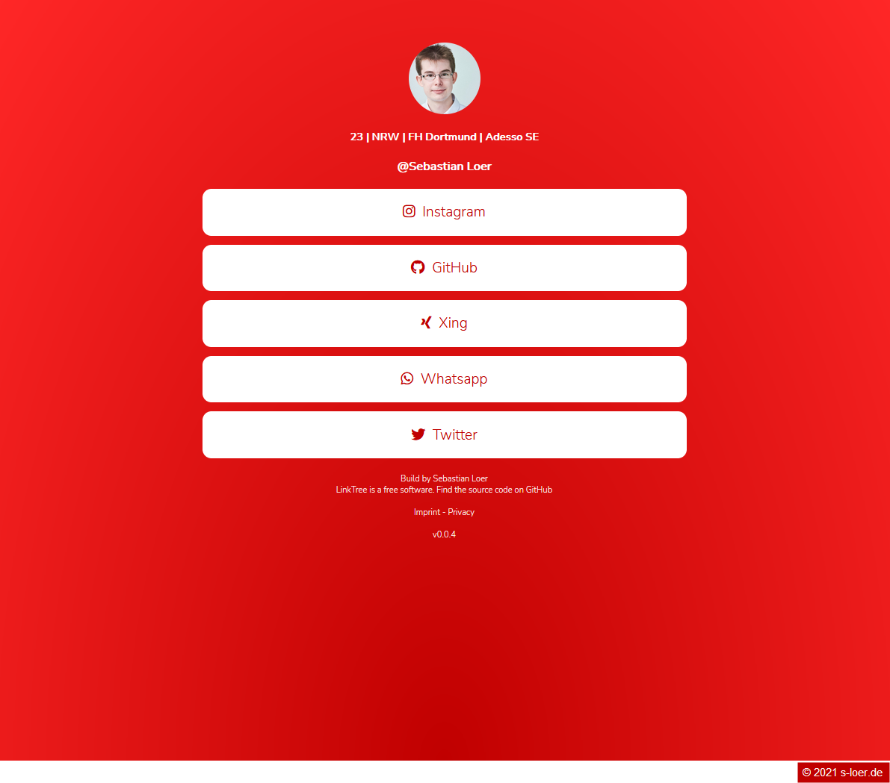

# LinkTree

Repo for [https://link.s-loer.de/](https://link.s-loer.de/)

## Disclaimer

This is my approach building a little linktree webpage. Maybe it's good, maybe it's not.

## Branches

**development** : \
contains the most current development state of this website with all new features \

**master** : \
contains the current live state of this website which is deployed on my webserver

## Server setup

The webpage is written in php. This code has to be put on a webserver which supports php.

## Configuration

You can change every value in the `config.php` file which is located in the `config` folder. A sample file is provided, just rename the file `config.sample.php` to `config.php`. Then change the values to your needs and you are good to go.

| Option              | Description                                                       |
| ------------------- | ----------------------------------------------------------------- |
| $hashtag            | hashtag which should be showed at the bottom of the page          |
| $user               | text which should be showed after the @ at the top of the page    |
| $text               | text which should displayed unter the profile picture             |
| $title              | html title of the page                                            |
| $imprint            | link to the imprint of the page                                   |
| $privacy            | link to the privacy document of the page                          |
| $backgroundColors   | two colors which should be used for the background effect         |
| $fontColor          | color of the text on this page                                    |
| $linkColor          | color of the links on this page                                   |

## Add a Link

When you want to add a link you have to add this Code `array_push(self::$links, new LinkDto( ID , 'NAME' , 'LINK' , 'ICON' , date("Y-m-d H:i:s"), date("Y-m-d H:i:s")) );` to the init block of the Config Class in the `config.php` file. \
In the code you can change the name to what ever you want to be displayed. \
The Link should be the uri target where the user should go after clicking on the link element. \
In the Icon section you can enter one of the icons from fontawesome. [Here you can find a list of supported icons ](https://fontawesome.com/icons?d=gallery&p=2&s=solid&m=free) \
Then you only need to give every link you want to create a uniq id, just use a number.

Now you should have added a link to your LinkTree.

## Config generator
A config generator for this application is currently in the work by myself. When it is finished i will add a link that you can use it to create your config.php file.

## Screenshots

